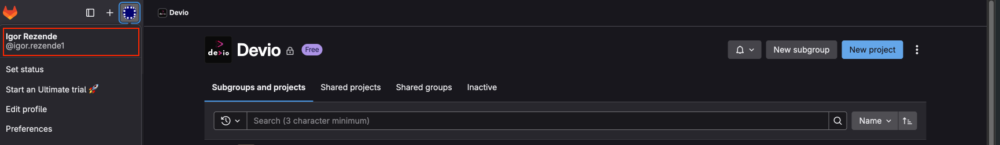

# 🗂️ GitLab - Repositórios de Código

## 📁 Onde estão os repositórios?

Todos os repositórios de projetos de clientes estão alocados na organização da Devio no GitLab:

🔗 [https://gitlab.com/deviobr](https://gitlab.com/deviobr)

---

## 👤 Conta de Acesso

1. Crie sua conta no GitLab utilizando seu e-mail empresarial:

   ```
   seu.nome@devio.com.br
   ```

2. Após criar a conta, copie o **nome de usuário** exibido no topo da página do GitLab.  
   Esse nome será necessário para que você seja adicionado aos projetos.

   

---

## 🚀 Iniciando Novos Projetos

- Para iniciar um novo projeto, solicite ao seu **gestor** que crie um **grupo** no GitLab.
- A partir desse grupo, você poderá criar os repositórios necessários para back-end, front-end, banco de dados, etc.

---

Para dúvidas sobre permissões, organização ou estrutura de repositórios, entre em contato com seu gestor ou com o time responsável.
